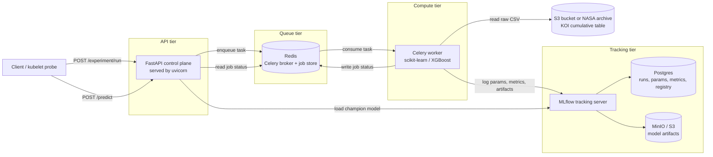
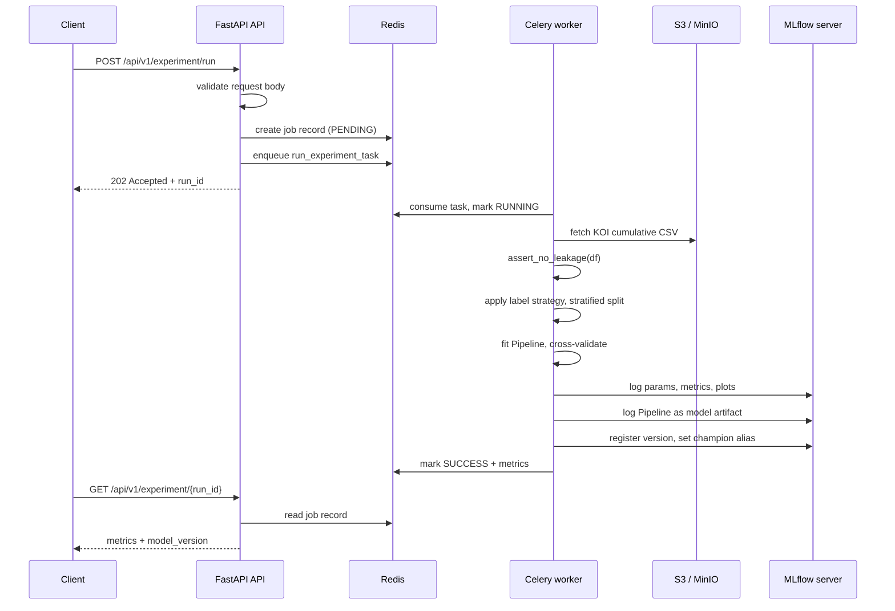

# Kepler Exoplanet Classification Engine

A containerized machine learning experiment pipeline that classifies NASA Kepler Objects of Interest (KOI) as confirmed exoplanets or false positives. A FastAPI control plane accepts experiment requests, Celery workers train and track models against MLflow, and the promoted model is served back through a prediction endpoint. The system is designed to be deployed to an AWS EKS cluster.

---

## Project status

Scaffold implemented and locally verified: `uv sync`, `uv run pytest` (25 passed), and `GET /health` against a running uvicorn process. Full Compose end-to-end training (Celery → MLflow UI → `POST /predict`) is the remaining integration check when Docker services are up.

See [Decision record](#decision-record) for the chronology of how we got here.

---

## Architecture

Five cooperating tiers. Each is a separate process locally (via Docker Compose) and a separate workload on EKS.



### What each tool does and why it is here

**FastAPI + uvicorn — the control plane.** FastAPI owns the HTTP surface and nothing else. It validates requests with Pydantic, enqueues work, reads job status, and serves predictions. It deliberately does *no* training: a training run takes tens of seconds to minutes, which would block a request worker and make Kubernetes readiness probes flap. uvicorn is the ASGI server; in the container it runs as PID 1 under a non-root user.

**Celery + Redis — asynchronous execution.** `POST /experiment/run` returns `202 Accepted` with a `run_id` immediately, then a Celery worker performs the training out of band. Redis plays two distinct roles: Celery's broker/result backend, and a job-status store that the API reads to answer `GET /experiment/{run_id}`. Splitting the worker into its own process means training load never competes with request handling, and on EKS the two scale independently — the API on request rate, the worker on queue depth.

**boto3 — data ingestion.** The KOI dataset is read through a `KeplerDataSource` protocol with three interchangeable implementations: `S3DataSource` (boto3, the production path), `LocalCSVDataSource` (offline development and tests), and `NasaArchiveDataSource` (fetches live from NASA's TAP service). The active source is chosen by configuration, so the same training code runs unchanged in a test, on a laptop, and against a real bucket. On EKS the pod uses an IRSA service-account role rather than static keys.

**scikit-learn + XGBoost — model training.** Preprocessing and the estimator are assembled into a single scikit-learn `Pipeline`, and that whole Pipeline is what gets logged as the model artifact. This is the key defense against train/serve skew: imputation medians and scaler statistics are fitted on training data and travel *with* the model, so `/predict` cannot silently apply different preprocessing than training did. Four estimators are selectable per run (logistic regression, random forest, gradient boosting, XGBoost).

**MLflow — experiment tracking and model registry.** The worker logs hyperparameters, metrics, and artifacts to a standalone MLflow tracking server. Metadata (runs, params, metrics, registry) lives in Postgres; model artifacts live in MinIO locally and S3 on EKS. A run that beats the incumbent is registered as a new model version and gets the `champion` alias. The API resolves `models:/kepler-koi-classifier@champion` at inference time, which means promoting a model requires no redeploy.

**Docker — containerization.** A single multi-stage image serves both the API and the worker; only the start command differs. This guarantees the two tiers have byte-identical dependency trees, which matters because a Pipeline unpickled by a different scikit-learn version than trained it can fail or, worse, behave subtly differently.

**Postgres and MinIO** exist only to make the local stack faithful to the deployed one. On EKS they are replaced by RDS and a real S3 bucket, with no application code change.

### Why the tracking server is standalone rather than a local `./mlruns` directory

Workers are horizontally scaled and ephemeral. A file-based tracking store on a pod's local disk would give each worker a private, disposable view of experiment history, and the API — running in a different pod — could not read it at all. A shared server with Postgres behind it is the only arrangement where "the champion model" is a globally meaningful concept.

---

## Training flow

_Verified in unit tests via eager Celery + sqlite MLflow; Compose path is the full integration check._



## Inference flow

_Implemented._ `POST /predict` validates the incoming stellar transit metrics against physical bounds, coerces them into a single-row DataFrame with columns in the exact training order, and calls the cached champion Pipeline. The model is loaded lazily on first use and held behind a TTL cache and a thread lock, so a promotion is picked up within the TTL without a restart and without a thundering herd of concurrent loads.

---

## The classification problem, and the leakage discipline

This is the part of the design most worth reading, because the obvious approach produces a model that looks excellent and is worthless.

### Dataset

_Verified against NASA's live TAP service._ The KOI cumulative table has **9,564 rows and 153 columns**:

| `koi_disposition` | Rows | Share |
| --- | --- | --- |
| FALSE POSITIVE | 4,839 | 50.6% |
| CONFIRMED | 2,747 | 28.7% |
| CANDIDATE | 1,978 | 20.7% |

Download URL (verified HTTP 200, ~11.8 MB):

```
https://exoplanetarchive.ipac.caltech.edu/TAP/sync?query=select+*+from+cumulative&format=csv
```

### Target leakage: what we exclude and why

`koi_disposition` is the outcome of NASA's Robovetter vetting process. Several columns in the same table are *records of that same process*, not independent physical measurements. Feeding them to a classifier hands it the answer key.

We measured this. The trivial rule "if any `koi_fpflag_*` is set, predict FALSE POSITIVE" achieves **99.6% precision, 98.0% recall, and 98.8% overall accuracy** on its own. Only 21 rows in the entire table have a flag set without being a false positive.

Excluded as leakage:

- **`koi_fpflag_nt`, `koi_fpflag_ss`, `koi_fpflag_co`, `koi_fpflag_ec`** — the four Robovetter false-positive test outcomes. These *are* the vetting decision, decomposed.
- **`koi_pdisposition`** — the Kepler pipeline's own verdict. It agrees with the target on 9,554 of 9,564 rows; as a binary predictor it scores 99.9%.
- **`koi_score`** — Robovetter disposition confidence. Circular by construction. It has a second, subtler problem: it is non-null for exactly the 8,054 rows with `koi_tce_delivname = 'q1_q17_dr25_tce'`, so even a missingness indicator derived from it encodes delivery provenance.
- **`kepler_name`** — populated only for confirmed planets, so its presence alone perfectly separates one class.
- **`koi_comment`, `koi_disp_prov`, `koi_vet_stat`, `koi_vet_date`** — free-text and metadata describing why and when a disposition was assigned.

A model trained on these features would report ~99% accuracy and then fail completely on its actual job: scoring newly discovered KOIs that have not been vetted yet, where none of these columns exist.

`ml/features.py` enforces this with an explicit allowlist plus a denylist, and `assert_no_leakage(df)` raises `LeakageViolationError` before any model sees the data. The check runs at training time, in CI, and as its own unit test — the highest-value test in the suite.

### Features actually used

Fourteen physical measurements, all verified against NASA's column definitions:

| Column | Meaning | Units |
| --- | --- | --- |
| `koi_period` | Orbital period between consecutive transits | days |
| `koi_time0bk` | Transit epoch, BJD − 2,454,833.0 | days |
| `koi_impact` | Sky-projected star-to-planet separation at conjunction, normalized by stellar radius | dimensionless |
| `koi_duration` | Transit duration, first to last contact | hours |
| `koi_depth` | Stellar flux lost at transit minimum | ppm |
| `koi_prad` | Planetary radius | Earth radii |
| `koi_teq` | Equilibrium temperature | K |
| `koi_insol` | Insolation flux relative to Earth | Earth flux |
| `koi_model_snr` | Transit signal-to-noise ratio | dimensionless |
| `koi_tce_plnt_num` | TCE planet number federated to the KOI | integer |
| `koi_steff` | Stellar effective temperature | K |
| `koi_slogg` | Stellar surface gravity | log₁₀(cm s⁻²) |
| `koi_srad` | Stellar radius | solar radii |
| `koi_kepmag` | Kepler-band magnitude | mag |

`ra` and `dec` are excluded from the baseline. They are sky coordinates, not physics, and can act as a proxy for detector position and observing systematics — inflating validation scores without generalizing. They remain available as a deliberate opt-in experiment.

### Missing data

Missingness is **blockwise, not scattered**: the same 363 rows lack the entire transit-fit-derived group (`koi_impact`, `koi_depth`, `koi_prad`, `koi_teq`, `koi_model_snr`, `koi_steff`, `koi_slogg`, `koi_srad`) because no full fit was available. Rather than eight independent imputation flags, the preprocessor emits a single "has full fit" indicator alongside median imputation, which is both more honest about the mechanism and cheaper in feature count.

### Label strategy

Default is **binary CONFIRMED vs FALSE POSITIVE** across 7,586 rows, matching the "exoplanet vs false positive" framing. `CANDIDATE` is dropped from training because it means "not yet vetted either way" rather than a distinct physical class — a model trained on it partly learns *how far along the vetting queue an object is*. Candidates instead become the natural inference-time input. Two alternate strategies (`not_false_positive` over all 9,564 rows, and three-class `multiclass`) are selectable per run.

### Data quality note

One row violates the documented domain: KOI K00477.01 (`kepid` 10934674) has `koi_fpflag_nt = 465` where the column is specified as 0 or 1. The anomaly is present in the Kaggle mirror too. Validate domains rather than trusting the spec.

---

## Repository layout

```
.
├── pyproject.toml                  # uv project: deps, dev dependency group, ruff + pytest config
├── uv.lock                         # committed lockfile for reproducible builds
├── .python-version                 # "3.12", written by `uv python pin`
├── .env.example                    # every setting with safe local defaults
├── Dockerfile                      # multi-stage uv build; one image for API and worker
├── docker-compose.yml              # api, worker, redis, mlflow, postgres, minio, minio-init
├── tasks.ps1                       # PowerShell task runner (setup/run/worker/test/lint/up/down)
├── README.md                       # this file
│
├── src/kepler_engine/
│   ├── main.py                     # create_app() factory: routers, error handlers, metrics, lifespan
│   │
│   ├── core/
│   │   ├── config.py               # pydantic-settings Settings, KEPLER_ env prefix, cached accessor
│   │   ├── logging.py              # structlog JSON logs to stdout (CloudWatch-friendly)
│   │   ├── lifespan.py             # startup/shutdown: Redis pool, MLflow URI, model warmup
│   │   └── exceptions.py           # ModelNotFoundError, DataIngestionError, LeakageViolationError
│   │
│   ├── api/
│   │   ├── deps.py                 # DI providers for Settings, Redis, JobStore, InferenceService
│   │   ├── errors.py               # domain exceptions -> RFC 9457 problem+json responses
│   │   └── v1/
│   │       ├── router.py           # aggregates sub-routers under /api/v1
│   │       ├── health.py           # liveness and readiness endpoints
│   │       ├── experiments.py      # run / status / list endpoints
│   │       └── predictions.py      # single and batch prediction
│   │
│   ├── schemas/
│   │   ├── experiment.py           # ExperimentRunRequest, ExperimentAccepted, ExperimentStatus
│   │   ├── prediction.py           # TransitMetrics with physical bounds, PredictionResponse
│   │   └── health.py               # HealthResponse, ReadinessResponse
│   │
│   ├── ml/
│   │   ├── features.py             # leakage allowlist/denylist + assert_no_leakage()
│   │   ├── labels.py               # binary / not_false_positive / multiclass strategies
│   │   ├── preprocessing.py        # ColumnTransformer: median impute, missing indicator, scaling
│   │   ├── models.py               # estimator factory with per-model default hyperparameters
│   │   ├── evaluation.py           # metrics, classification report, confusion matrix, importances
│   │   └── trainer.py              # orchestrates ingest -> validate -> fit -> evaluate -> log
│   │
│   ├── services/
│   │   ├── ingestion.py            # KeplerDataSource protocol: S3 / local CSV / NASA TAP
│   │   ├── experiment_service.py   # enqueue (API side) and execute (worker side)
│   │   ├── inference_service.py    # cached champion model, DataFrame coercion
│   │   ├── job_store.py            # Redis job lifecycle: PENDING/RUNNING/SUCCESS/FAILURE
│   │   └── mlflow_client.py        # register, promote alias, resolve versions, list runs
│   │
│   └── workers/
│       ├── celery_app.py           # Celery config: Redis broker, JSON serializer, time limits
│       └── tasks.py                # run_experiment_task with job-status updates
│
├── data/
│   ├── raw/.gitkeep                # gitignored landing zone for downloaded datasets
│   └── samples/kepler_koi_sample.csv  # committed fixture so tests run offline
│
├── scripts/
│   ├── download_koi_dataset.py     # pull the cumulative table from NASA TAP into data/raw
│   └── bootstrap_minio.py          # create the artifact bucket for local Compose
│
├── deploy/k8s/                     # EKS manifests with probes wired to the health endpoints
│   ├── configmap.yaml
│   ├── secret.example.yaml
│   ├── api-deployment.yaml
│   ├── api-service.yaml
│   ├── worker-deployment.yaml
│   └── hpa.yaml
│
└── tests/
    ├── conftest.py                 # TestClient, fake Redis, sample frames, eager Celery
    ├── test_health.py
    ├── test_features.py            # asserts every leakage column is rejected
    ├── test_ingestion.py           # moto-mocked S3 and local CSV parity
    ├── test_trainer.py             # end-to-end train against a temp MLflow store
    └── test_api_endpoints.py
```

---

## Getting started

### Prerequisites

- **Docker** — for the full Compose stack
- **uv** — install with the command in step 1 if missing
- **Python** — no local interpreter is required. uv downloads and manages CPython 3.12 itself.

### 1. Install uv and sync the environment

```powershell
# Install uv (0.12.1 or newer)
powershell -ExecutionPolicy ByPass -c "irm https://astral.sh/uv/install.ps1 | iex"

# Pin the interpreter and create .venv from the lockfile
uv python pin 3.12
uv sync
```

`uv sync` reads `uv.lock` and builds `.venv` exactly, including the `dev` dependency group. Never `pip install` into this environment — add dependencies with `uv add <pkg>` (or `uv add --dev <pkg>`) so the lockfile stays authoritative.

### 2. Run the full stack

Compose is the intended development path, because training needs Redis, a worker, and MLflow all present.

```powershell
copy .env.example .env
docker compose up --build
```

Services once healthy:

| Service | URL | Purpose |
| --- | --- | --- |
| API | http://localhost:8000 | control plane |
| API docs | http://localhost:8000/docs | interactive OpenAPI |
| MLflow UI | http://localhost:5000 | experiment history, model registry |
| MinIO console | http://localhost:9001 | artifact bucket browser |

### 3. Drive a training run end to end

Using `Invoke-RestMethod`, which handles JSON natively and avoids `curl.exe`'s quote-escaping problems under PowerShell:

```powershell
$base = "http://localhost:8000/api/v1"

# Kick off training; returns immediately with a run_id
$job = Invoke-RestMethod -Method Post -Uri "$base/experiment/run" `
  -ContentType "application/json" `
  -Body (@{ model_type = "xgboost"; test_size = 0.2; cv_folds = 5 } | ConvertTo-Json)

# Poll until SUCCESS or FAILURE
do {
    Start-Sleep -Seconds 3
    $status = Invoke-RestMethod "$base/experiment/$($job.run_id)"
    Write-Host $status.status
} while ($status.status -in @("PENDING", "RUNNING"))

$status.metrics

# Predict with the promoted champion
$transit = @{
    koi_period = 9.488; koi_time0bk = 170.539; koi_impact = 0.146
    koi_duration = 2.958; koi_depth = 615.8;  koi_prad = 2.26
    koi_teq = 793.0;     koi_insol = 93.59;   koi_model_snr = 35.8
    koi_tce_plnt_num = 1; koi_steff = 5455.0; koi_slogg = 4.467
    koi_srad = 0.927;    koi_kepmag = 15.347
}
Invoke-RestMethod -Method Post -Uri "$base/predict" `
  -ContentType "application/json" `
  -Body (@{ records = @($transit) } | ConvertTo-Json)
```

### 4. Run without Docker (API only)

Useful for fast iteration on routing and schemas. Training endpoints will fail without Redis and MLflow reachable.

```powershell
uv run uvicorn kepler_engine.main:app --reload
uv run celery -A kepler_engine.workers.celery_app worker --loglevel=info --pool=solo
```

`--pool=solo` is required on Windows; Celery's default prefork pool does not work there. Linux containers use the default.

### 5. Tests and linting

```powershell
uv run pytest
uv run ruff check .
```

Tests run fully offline: S3 is mocked with `moto`, MLflow writes to a temporary file store, Redis is faked, and Celery runs in eager mode.

---

## API reference

_Implemented._ All application routes are versioned under `/api/v1`. Health endpoints are unversioned so probe configuration never breaks on an API version bump.

| Method | Path | Purpose |
| --- | --- | --- |
| GET | `/health` | Liveness. No dependency checks, always 200 while the process is alive. |
| GET | `/health/ready` | Readiness. Verifies Redis, MLflow, and champion-model loadability. |
| POST | `/api/v1/experiment/run` | Enqueue a training run. Returns `202` + `run_id`. |
| GET | `/api/v1/experiment/{run_id}` | Job status, and metrics once complete. |
| GET | `/api/v1/experiment` | Recent runs from MLflow. |
| POST | `/api/v1/predict` | Classify one or many transit-metric records. |
| GET | `/metrics` | Prometheus scrape endpoint. |

### Why liveness and readiness are separate

Kubernetes treats them differently, and conflating them causes outages. A failing **liveness** probe restarts the pod; a failing **readiness** probe only removes it from the Service's endpoint list. If `/health` checked Redis, then a brief Redis blip would restart every API pod simultaneously — turning a recoverable dependency hiccup into a full outage. So `/health` is deliberately trivial, and only `/health/ready` inspects dependencies.

---

## Configuration

All settings are read from the environment with the `KEPLER_` prefix via pydantic-settings, following 12-factor conventions. `.env.example` documents the full surface.

| Variable | Purpose |
| --- | --- |
| `KEPLER_ENV` | `local` / `staging` / `production`; drives log format and docs exposure |
| `KEPLER_LOG_LEVEL` | structlog level |
| `KEPLER_DATA_SOURCE` | `s3`, `local_csv`, or `nasa_archive` |
| `KEPLER_S3_BUCKET`, `KEPLER_S3_KEY` | dataset location when using the S3 source |
| `KEPLER_LOCAL_CSV_PATH` | dataset path when using the local source |
| `AWS_REGION`, `AWS_ACCESS_KEY_ID`, `AWS_SECRET_ACCESS_KEY` | boto3 credentials; omitted on EKS in favor of IRSA |
| `MLFLOW_TRACKING_URI` | tracking server address |
| `KEPLER_MLFLOW_EXPERIMENT_NAME` | experiment to log runs under |
| `KEPLER_REGISTERED_MODEL_NAME` | registry entry, default `kepler-koi-classifier` |
| `KEPLER_MODEL_ALIAS` | alias the API serves, default `champion` |
| `KEPLER_MODEL_CACHE_TTL_SECONDS` | how quickly a promotion is picked up |
| `KEPLER_REDIS_URL` | Celery broker, result backend, and job store |
| `KEPLER_PROMOTE_METRIC`, `KEPLER_PROMOTE_THRESHOLD` | which metric gates promotion, and its floor |

MLflow's own S3 client variables (`MLFLOW_S3_ENDPOINT_URL`, `AWS_*`) are set on the MLflow **server** in Compose. They are intentionally *not* set on clients: with proxied artifact storage, an endpoint URL present on both sides makes MLflow concatenate them into an invalid `s3://bucket/key/bucket/key` path.

---

## Dependency pins, and the constraint that shapes them

_Verified against the PyPI JSON API._ Two constraints drive the pin set.

**Python 3.12, not 3.10.** Python 3.10 has aged out of the scientific stack. Current `numpy` (2.5.1), `xgboost` (3.3.0), and `scipy` (1.18.0) require ≥3.12; `scikit-learn` (1.9.0) and `pandas` (3.0.5) require ≥3.11. Targeting 3.10 would have meant holding five packages a release or two behind, on versions no longer receiving fixes. Since the intent of the stack is the ML libraries and EKS is indifferent to the interpreter's minor version, we moved to 3.12.

**MLflow caps pandas below 3.0.** MLflow 3.15.1 declares `pandas<3`, `numpy<3`, `scipy<2`, `scikit-learn<2`. So pandas stays on **2.3.3** — the highest 2.x release — even though 3.0.5 exists and would run fine on 3.12. This is the one pin in the set that is not the latest available version, and the reason is a hard resolver constraint, not caution.

Everything else runs at its current release:

| Package | Version | Role |
| --- | --- | --- |
| fastapi | 0.141.1 | HTTP framework |
| uvicorn | 0.52.1 | ASGI server |
| pydantic | 2.13.4 | request/response validation |
| pydantic-settings | 2.14.2 | typed environment configuration |
| scikit-learn | 1.9.0 | pipelines, preprocessing, baseline models |
| xgboost | 3.3.0 | gradient-boosted trees |
| numpy | 2.5.1 | numerics |
| scipy | 1.18.0 | scientific primitives (transitive, pinned explicitly) |
| pandas | 2.3.3 | dataframes — capped by MLflow |
| mlflow | 3.15.1 | tracking and model registry |
| boto3 | 1.43.63 | S3 ingestion |
| celery | 5.6.3 | distributed task queue |
| redis | 8.1.0 | broker and job-store client |
| joblib | 1.5.3 | model serialization |
| structlog | 26.1.0 | structured JSON logging |
| prometheus-fastapi-instrumentator | 8.1.0 | metrics endpoint |
| pytest / httpx / moto | 9.1.1 / 0.28.1 / 5.2.2 | dev group: tests, API client, S3 mocking |

`requires-python` is set to `>=3.12,<3.13` so uv resolves this set deterministically.

---

## MLflow 3.x usage notes

MLflow 3 changed several APIs that virtually every tutorial still uses in their 2.x form. These are the ones that affect this project, all verified against 3.15.1:

- **`log_model(model, name=...)`, not `artifact_path=...`.** `artifact_path` is deprecated and emits a warning; passing both raises `MlflowException`.
- **The sklearn flavor now defaults to `skops` serialization**, not cloudpickle. skops rejects "untrusted types," which includes custom transformers and non-top-level classes — exactly what a real Pipeline contains. We pass `serialization_format="cloudpickle"` explicitly.
- **`mlflow.get_artifact_uri("model")` no longer resolves logged models.** In MLflow 3 models are first-class entities stored outside the run's artifact tree. Use the `ModelInfo.model_uri` returned by `log_model`.
- **Aliases replace stages.** `Staging`/`Production` stage transitions are deprecated. We use `client.set_registered_model_alias(name, "champion", version)` and load `models:/kepler-koi-classifier@champion`.
- **`get_latest_versions()` is deprecated** because its signature is stage-oriented. The replacement is `search_model_versions(filter_string=f"name='{name}'", order_by=["version_number DESC"], max_results=1)`.
- **`autolog(log_models=False)`.** Autolog logs a model internally; combined with an explicit `log_model` call, MLflow 3 silently attaches *two* LoggedModels to the run rather than overwriting. We keep autologging for params and metrics and log the model ourselves.
- **The server needs `--allowed-hosts`.** MLflow 3 ships host and CORS middleware that is localhost-only by default, so `--host 0.0.0.0` alone yields a server that rejects requests from other containers.
- **`--artifacts-destination` is what enables artifact proxying**, not `--default-artifact-root`. Also note `mlflow db upgrade` must be run as a pre-start step when bumping MLflow versions; only a fresh database auto-migrates.
- **File store is maintenance-mode in 3.15+.** Local tests and offline smoke runs use `sqlite:///...` (or set `MLFLOW_ALLOW_FILE_STORE=true`). Compose continues to use Postgres.

---

## Container build

Multi-stage, with dependency installation separated from source copying so that editing application code does not invalidate the dependency layer.

**Builder:** `ghcr.io/astral-sh/uv:0.12.1-python3.12-trixie-slim`. _Verified: this tag resolves; the widely cited `bookworm` variants are stale (frozen since February 2026) and the version-pinned bookworm form returns 404 — uv's Debian images are now trixie-based._ The build runs `uv sync --locked --no-dev --no-editable` with a cache mount and bind-mounted lockfile.

**Runtime:** `python:3.12-slim-trixie`, copying only `/app/.venv` from the builder. Runs as a non-root UID, declares a `HEALTHCHECK` against `/health`, and defaults to the uvicorn entrypoint. The worker uses the same image and overrides the command — identical dependency trees on both tiers, which is what keeps a Pipeline trained by the worker loadable by the API.

`.dockerignore` excludes `.venv` (platform-specific and must be rebuilt inside the image), `data/raw`, `mlruns`, and caches.

---

## EKS deployment shape

- **API Deployment** — liveness probe on `/health`, readiness on `/health/ready`, an HPA on request rate or CPU.
- **Worker Deployment** — same image, `celery worker` command, no probes (it serves no traffic), scaled on queue depth.
- **Redis** — ElastiCache, or a StatefulSet for non-production.
- **MLflow** — its own Deployment plus Service, backed by RDS Postgres, with `mlflow db upgrade` as an init container or pre-upgrade Job.
- **Artifacts** — a real S3 bucket. The worker's ServiceAccount carries an IRSA-annotated IAM role, so no static AWS keys exist in the cluster.
- **Config** — non-secret values in a ConfigMap, credentials in a Secret (or External Secrets pulling from AWS Secrets Manager).

---

## Decision record

The chronology of how this design was reached, including the findings that changed it.

**1. Environment survey.** Workspace was empty and not a git repository. Docker 29.6.2 present. No `uv`. No usable Python — only the Windows Store `python.exe` stub. Shell is PowerShell, which later informed the `--pool=solo` note and the `tasks.ps1` choice over a Makefile.

**2. Async execution strategy — decided: Celery + Redis.** The alternatives considered were FastAPI `BackgroundTasks` with an in-process registry, a lightweight RQ/arq queue, and dispatching Kubernetes Jobs via the Python client. Celery was chosen for durability: in-process background tasks die with the pod and lose the run, which is unacceptable for a job that may run for minutes. This added the broker and worker tiers to the architecture.

**3. Local toolchain — decided: install it.** Rather than a code-only scaffold, we will install uv, pin the interpreter, and actually execute a training run so the pipeline is verified rather than merely plausible.

**4. Dependency version research — changed the plan.** Checking every package against the PyPI JSON API surfaced that Python 3.10, as originally specified, no longer supports the current scientific stack: `numpy`, `xgboost`, and `scipy` require ≥3.12, and `scikit-learn` and `pandas` require ≥3.11. Presented as a tradeoff and resolved by **moving to Python 3.12**.

**5. Dataset research — changed the modeling approach materially.** Verified the KOI schema against NASA's column definitions and live TAP queries: 9,564 rows, 153 columns, class balance 50.6/28.7/20.7. This surfaced the leakage problem and quantified it — the `koi_fpflag_*` columns alone reproduce the label at 98.8% accuracy, and `koi_pdisposition` at 99.9%. Consequences: an explicit feature allowlist with an enforced denylist, `koi_score` excluded for its provenance-encoding missingness, `ra`/`dec` held out of the baseline, and a binary CONFIRMED vs FALSE POSITIVE default that drops the unvetted CANDIDATE class. The same research found the blockwise missingness pattern (363 rows, whole transit-fit block) and the `koi_fpflag_nt = 465` data-quality violation.

**6. MLflow deployment — decided: standalone server with Postgres + MinIO.** A local `./mlruns` store cannot work across horizontally scaled workers and a separate API pod, and the Compose topology should mirror the EKS target so promotion behavior is exercised locally.

**7. MLflow 3 API verification — corrected several planned call sites.** Checking the 3.15.1 API rather than trusting 2.x tutorial patterns caught the `name` vs `artifact_path` deprecation, the silent switch to `skops` serialization, the removal of `get_artifact_uri` model resolution, the stages-to-aliases migration, the `get_latest_versions` deprecation, the duplicate-LoggedModel behavior with autolog, and the new host/CORS middleware that would otherwise have made the Compose MLflow server unreachable from other containers.

**8. Docker base image verification — rejected the obvious tag.** `ghcr.io/astral-sh/uv:python3.10-bookworm-slim` still resolves, so a naive existence check passes it, but its image config shows it frozen since February 2026 and no bookworm variant is published for current uv releases at all. Confirmed `0.12.1-python3.12-trixie-slim` returns HTTP 200 and adopted it.

**9. Final resolver check — one pin is not the latest.** Reading MLflow 3.15.1's `requires_dist` revealed a `pandas<3` cap, so pandas is held at 2.3.3 (verified as the highest 2.x release) despite 3.0.5 being available and 3.12-compatible. Without this check, `uv sync` would have failed to resolve or silently downgraded pandas.

### Still open

- Whether to add `koi_num_transits`, `koi_count`, `koi_max_mult_ev`, `koi_ror`, and `koi_srho` to the feature set as a second experiment. They are legitimate physical measurements and likely to help, but the baseline stays deliberately narrow.
- Whether promotion should be fully automatic on threshold, or gated behind a manual `POST /experiment/{run_id}/promote` call. The scaffold implements threshold-gated automatic promotion with a configurable metric and floor.
- Dataset snapshot pinning. NASA re-runs the cumulative table as candidates get confirmed, so row counts drift. Downloaded files should carry a date in the filename for reproducibility.

---

## License

Not yet specified.
