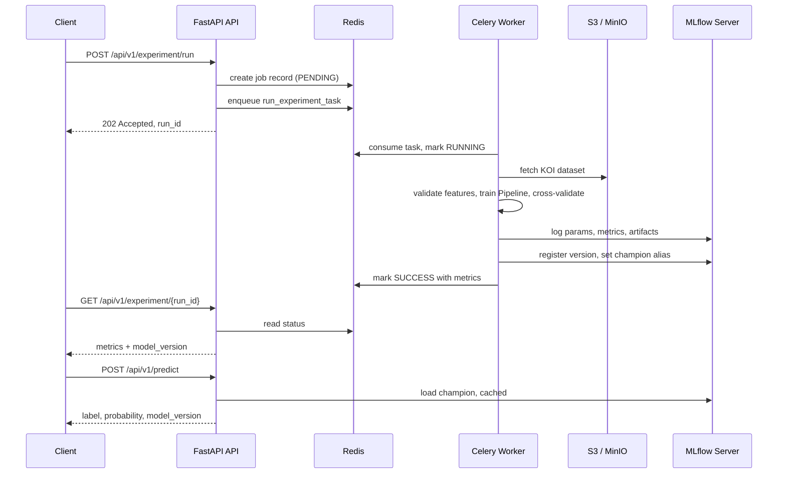

## Confirmed decisions

- Python 3.12 (not 3.10 — current scikit-learn 1.9 / pandas 3.0 / numpy 2.5 / xgboost 3.3 all require 3.11+ or 3.12+)
- Celery + Redis for async training, separate worker process/Deployment
- MLflow tracking server in Compose: Postgres backend store + MinIO artifact store
- Install `uv`, pin 3.12, create `.venv`, and smoke-test locally

## Directory structure

```
c:\Users\Justi\lab\
├── pyproject.toml                  # uv project: deps, dependency-groups (dev), ruff + pytest config
├── uv.lock                         # generated lockfile, committed for reproducible builds
├── .python-version                 # "3.12", written by `uv python pin`
├── .env.example                    # every settings key with safe local defaults; documents config surface
├── .gitignore / .dockerignore      # excludes .venv, mlruns, data/raw, __pycache__
├── Dockerfile                      # multi-stage uv build; one image serves API and worker
├── docker-compose.yml              # api, worker, redis, mlflow, postgres, minio, minio-init
├── tasks.ps1                       # PowerShell task runner (setup/run/worker/test/lint/up/down)
├── README.md                       # quickstart, architecture diagram, endpoint contracts
│
├── src/kepler_engine/
│   ├── main.py                     # create_app() factory: mounts routers, exception handlers,
│   │                               #   Prometheus instrumentator, lifespan
│   │
│   ├── core/
│   │   ├── config.py               # pydantic-settings Settings, env prefix KEPLER_; nested groups
│   │   │                           #   for aws/s3, mlflow, redis, training. @lru_cache get_settings()
│   │   ├── logging.py              # structlog JSON logs to stdout (12-factor / CloudWatch-friendly)
│   │   ├── lifespan.py             # asynccontextmanager: init Redis pool, set MLflow tracking URI,
│   │   │                           #   warm the model cache, dispose on shutdown
│   │   └── exceptions.py           # domain errors: ModelNotFoundError, DataIngestionError,
│   │                               #   LeakageViolationError, ExperimentNotFoundError
│   │
│   ├── api/
│   │   ├── deps.py                 # DI providers: Annotated[Settings, Depends(...)], Redis client,
│   │   │                           #   JobStore, InferenceService
│   │   ├── errors.py               # maps domain exceptions -> RFC 9457 problem+json responses
│   │   └── v1/
│   │       ├── router.py           # aggregates sub-routers under /api/v1
│   │       ├── health.py           # GET /health (liveness, no deps, always 200)
│   │       │                       # GET /health/ready (readiness: Redis PING, MLflow reachable,
│   │       │                       #   champion model loadable)
│   │       ├── experiments.py      # POST /experiment/run -> 202 + run_id (enqueues Celery task)
│   │       │                       # GET  /experiment/{run_id} -> job status/metrics
│   │       │                       # GET  /experiment -> recent runs from MLflow
│   │       └── predictions.py      # POST /predict -> single or batch prediction
│   │
│   ├── schemas/
│   │   ├── experiment.py           # ExperimentRunRequest (model_type enum, hyperparams,
│   │   │                           #   test_size, cv_folds, label_strategy, data_source override),
│   │   │                           #   ExperimentAccepted, ExperimentStatus, ExperimentMetrics
│   │   ├── prediction.py           # TransitMetrics (one field per allowed feature, with physical
│   │   │                           #   bounds via Field(gt=/le=)), PredictionRequest,
│   │   │                           #   PredictionResponse (label, probability, model_version, run_id)
│   │   └── health.py               # HealthResponse, ReadinessResponse with per-dependency checks
│   │
│   ├── ml/
│   │   ├── features.py             # THE leakage guard. FEATURE_COLUMNS allowlist,
│   │   │                           #   LEAKAGE_COLUMNS denylist, TARGET_COLUMN,
│   │   │                           #   assert_no_leakage(df) raising LeakageViolationError
│   │   ├── labels.py               # label strategies: binary CONFIRMED vs FALSE POSITIVE (default,
│   │   │                           #   drops CANDIDATE), not_false_positive, multiclass
│   │   ├── preprocessing.py        # build_preprocessor(): ColumnTransformer with SimpleImputer
│   │   │                           #   (median) + MissingIndicator for the blockwise-missing
│   │   │                           #   transit-fit group, StandardScaler for linear models
│   │   ├── models.py               # MODEL_REGISTRY factory: logistic_regression, random_forest,
│   │   │                           #   gradient_boosting, xgboost -> (estimator, default_params)
│   │   ├── evaluation.py           # compute_metrics(): accuracy, precision, recall, f1, roc_auc,
│   │   │                           #   pr_auc, confusion matrix, per-class report; permutation
│   │   │                           #   importance + confusion-matrix PNG as MLflow artifacts
│   │   └── trainer.py              # ExperimentTrainer.run(): ingest -> validate -> label -> split
│   │                               #   -> Pipeline(preprocessor, estimator) -> stratified CV
│   │                               #   -> fit -> evaluate -> MLflow log -> register + promote
│   │
│   ├── services/
│   │   ├── ingestion.py            # KeplerDataSource Protocol; S3DataSource (boto3 get_object ->
│   │   │                           #   pandas), LocalCSVDataSource, NasaArchiveDataSource (TAP);
│   │   │                           #   get_data_source(settings) selector + schema validation
│   │   ├── experiment_service.py   # enqueue_experiment() (API side) and execute_experiment()
│   │   │                           #   (worker side) — keeps Celery out of the router
│   │   ├── inference_service.py    # loads models:/kepler-koi-classifier@champion via
│   │   │                           #   mlflow.pyfunc, TTL cache + thread lock, DataFrame
│   │   │                           #   coercion in exact FEATURE_COLUMNS order
│   │   ├── job_store.py            # Redis-hashed job lifecycle: PENDING/RUNNING/SUCCESS/FAILURE
│   │   │                           #   + progress, metrics, error, timestamps, TTL
│   │   └── mlflow_client.py        # thin MLflow 3 wrapper: register_model, set champion alias,
│   │                               #   resolve latest via search_model_versions(order_by=
│   │                               #   ["version_number DESC"]), list recent runs
│   │
│   └── workers/
│       ├── celery_app.py           # Celery("kepler_engine"), Redis broker + result backend,
│       │                           #   JSON-only serializer, acks_late, prefetch=1, time limits
│       └── tasks.py                # @shared_task(bind=True) run_experiment_task: updates JobStore,
│                                   #   delegates to experiment_service, structured error capture
│
├── data/
│   ├── raw/.gitkeep                # gitignored landing zone for downloaded CSVs
│   └── samples/kepler_koi_sample.csv  # small committed fixture so tests/dev run offline
│
├── scripts/
│   ├── download_koi_dataset.py     # pulls the real cumulative table from NASA TAP into data/raw
│   └── bootstrap_minio.py          # creates the mlflow-artifacts bucket for local Compose
│
├── deploy/k8s/                     # EKS-ready manifests (probes wired to the health endpoints)
│   ├── configmap.yaml / secret.example.yaml
│   ├── api-deployment.yaml         # liveness -> /health, readiness -> /health/ready
│   ├── api-service.yaml
│   ├── worker-deployment.yaml      # same image, celery worker command, no probes
│   └── hpa.yaml
│
└── tests/
    ├── conftest.py                 # FastAPI TestClient, fake Redis, sample DataFrame, tmp
    │                               #   MLflow file-store fixtures; CELERY_TASK_ALWAYS_EAGER
    ├── test_health.py              # liveness 200 unconditionally; readiness degrades correctly
    ├── test_features.py            # asserts every koi_fpflag_*, koi_score, koi_pdisposition is
    │                               #   rejected by assert_no_leakage — the highest-value test
    ├── test_ingestion.py           # moto-mocked S3 + local CSV parity
    ├── test_trainer.py             # end-to-end train on the fixture against a temp MLflow store
    └── test_api_endpoints.py       # POST /experiment/run returns 202 + run_id; /predict contract
                                    #   and validation failures
```

## Design decisions worth flagging

**Target leakage is the main correctness risk.** `ml/features.py` holds an explicit allowlist of 14 physical measurements (`koi_period`, `koi_duration`, `koi_depth`, `koi_prad`, `koi_teq`, `koi_insol`, `koi_model_snr`, `koi_steff`, `koi_slogg`, `koi_srad`, `koi_impact`, `koi_time0bk`, `koi_tce_plnt_num`, `koi_kepmag`) and a denylist that `assert_no_leakage()` enforces at train time. The four `koi_fpflag_*` flags reproduce the label with 98.8% accuracy on their own, and `koi_pdisposition` / `koi_score` are the same vetting decision restated — including any of them yields a 99% "accuracy" that means nothing and collapses on unvetted KOIs, which is the actual deployment case. `ra`/`dec` are excluded from the baseline as detector-position proxies.

**Default label strategy is binary CONFIRMED vs FALSE POSITIVE** (7,586 of 9,564 rows), matching your "exoplanet vs false positive" framing. `CANDIDATE` means "not yet vetted" rather than a physical class, so it becomes inference-time input rather than training data.

**Preprocessing lives inside the sklearn Pipeline** that gets logged as the MLflow artifact, so `/predict` cannot drift from training. The 363 rows missing the entire transit-fit block get a single `MissingIndicator` feature rather than eight.

**MLflow 3 API specifics** (most tutorials are still on the 2.x patterns): `log_model(model, name=...)` — `artifact_path` is deprecated and passing both raises. sklearn's flavor now defaults to `skops` serialization, so we pass `serialization_format="cloudpickle"` explicitly for Pipeline compatibility. Promotion uses the `champion` **alias** (`models:/kepler-koi-classifier@champion`), not deprecated stages. `autolog(log_models=False)` prevents duplicate LoggedModel entities. The Compose server needs `--allowed-hosts` or it rejects non-localhost Host headers.

## Request flow



## Dockerfile approach

Builder stage `ghcr.io/astral-sh/uv:0.12.1-python3.12-trixie-slim` (verified live; the commonly cited `bookworm` tags are stale and 404 for current uv releases), `uv sync --locked --no-dev --no-editable` with cache mounts and a bind-mounted lockfile so dependency layers cache independently of source. Runtime stage `python:3.12-slim-trixie`, copies only `/app/.venv`, runs as non-root UID 1000, `HEALTHCHECK` against `/health`, `ENTRYPOINT` uvicorn with the worker overriding `command` in Compose and in the k8s Deployment.

## Verification before handoff

Install `uv`, `uv python pin 3.12`, `uv sync`, then `uv run pytest`, boot the API and confirm `/health`, bring up Compose to run one real training job end to end through Celery, confirm the run appears in the MLflow UI, and finally `POST /predict` against the promoted champion.